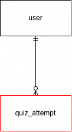

# bcs350-proj-02
Online quiz application

## About
This is the GitHub repository for an online quiz website. This application utilizes the client-server architecture to decide which questions to include, when the game starts, keeping track of the score and serving the HTML/CSS/JS files.

## Project Structure
```
bcs350-proj-02/
│
├── index.html          (Home page)
├── play.html           (Gameplay page)
├── results.html        (Results page)
├── signup.html         (Sign up page)
├── login.html          (Log in page)
│
├── css/
│   └── styles.css
│
├── js/
│   └── script.js
│
└── assets/
    └── images/
```

## How to Play
Visit the quiz website [here](https://jesseazizi.github.io/bcs350-proj-02/).

## How to Run

## Database Schema
